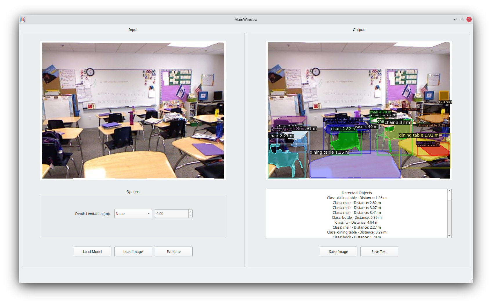
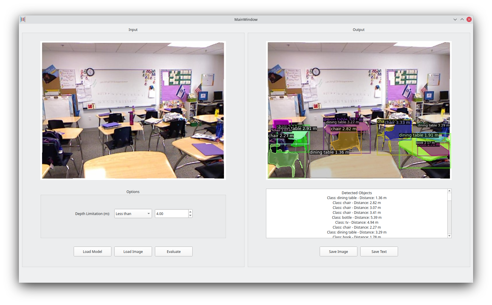
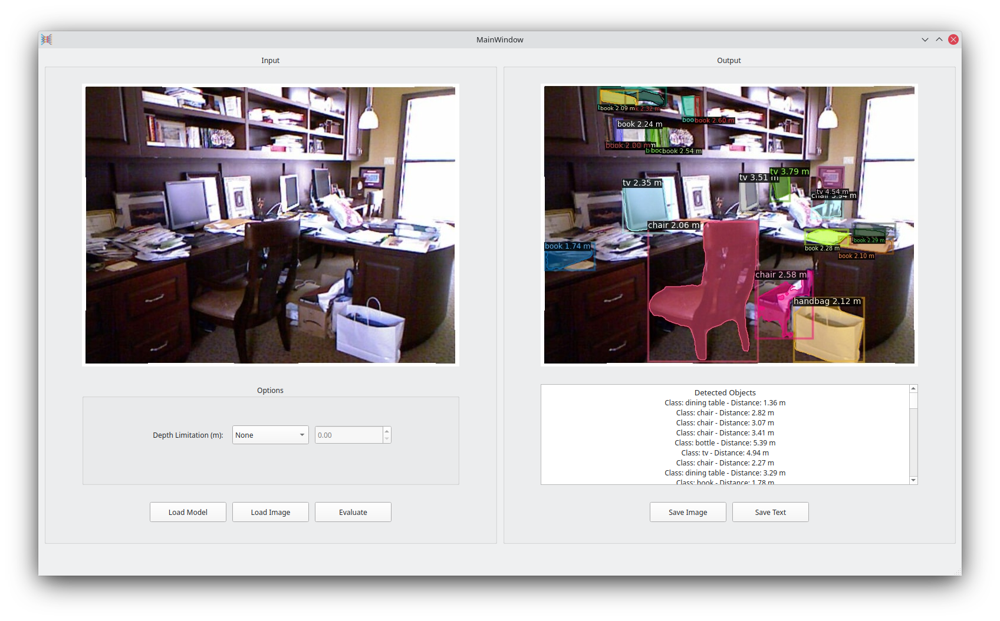
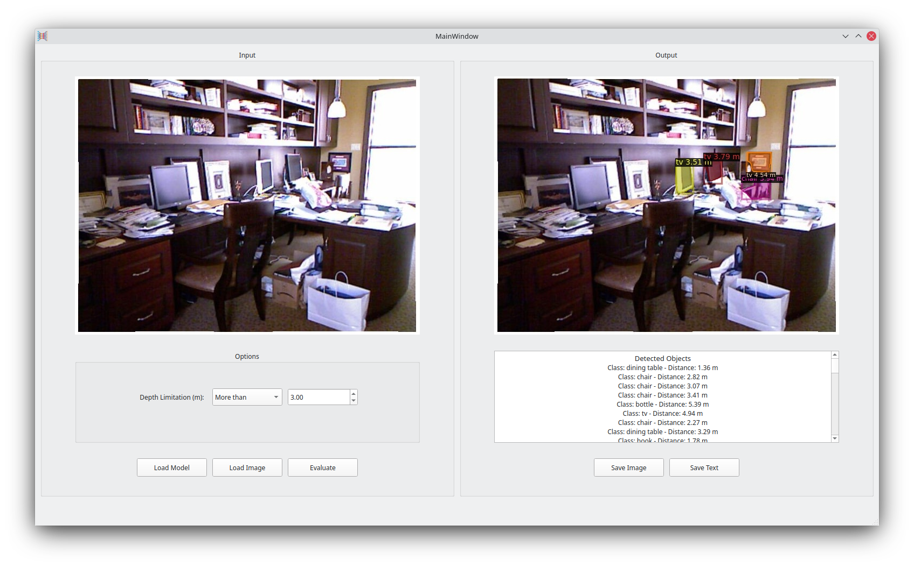
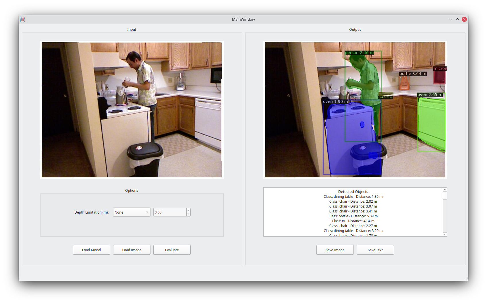

# Joint Object Detection and Depth Estimation for Images
* Mohammad Hossein Shokouhi - 99202567
* Deep Learning - Prof. Emad Fatemizadeh
* Sharif University of Technology
## Report
* Full description of the project, challenges we've faced, precision of the project and other details are available at the project [Report](Report.pdf).
* Here is a brief table of contents for the report:
  - Depth Estimation Network
    - Introduction
    - Network Architecture
    - Loss Function
    - Data Augmentation
    - Dataset
    - Implementation Details
    - Evaluation
  - Object Detection Network
    - Using the Detectron2 Library
    - Model
    - Introduction
    - Network Architecture
    - Evaluation
  - Joining the Networks
    - Evaluation
  - Graphical User Interface (GUI)
  - GitHub
    
## Installation
* **Note:** This project was created and tested on Kubuntu 21.04 OS. Therefore, IT IS STRONGLY RECOMMENDED to run this project on a Debian-based Linux OS.
* Follow these instructions to install and use the project:
1. Download the project from GitHub.
2. Go to the project directory and run the following command to install the necessary packages:
```
pip install -r Requirements.txt
```
3. Install [Detectron2](https://github.com/facebookresearch/detectron2) library using the following command:
```
pip install detectron2 -f https://dl.fbaipublicfiles.com/detectron2/wheels/cpu/torch1.10/index.html
```
5. Download the pre-trained model weights from [this link](https://drive.google.com/file/d/10-OSvP7IaQt_Vnl8MnfCLXSLpbGunH50/view?usp=sharing).
6. Run the following command to open the GUI:
```
python Main.py
```
5. Click on **Load Model** and select the file you downloaded in step 3.
6. Click on **Load Image** and select an arbitrary .jpg or .png image.
7. Click on **Evaluate** to generate the outputs. This usually takes 10-15 seconds.
8. You can use **Save Image** and **Save Text** buttons to download the outputs.
## Examples
* Below you can see many examples from the project's inputs, outputs, and GUI:





